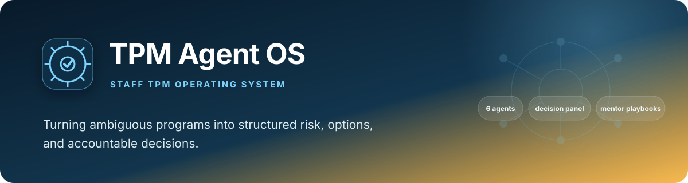
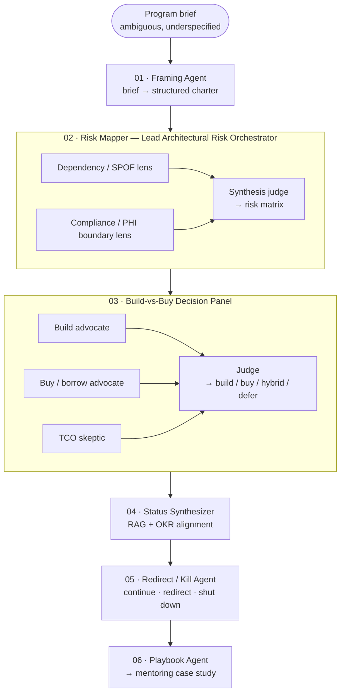

# tpm-agent-os

## A Multi-Agent Operating Model for Technical Program Management

> **Ambiguity in. Structure, risk, and a decision out.**

<div align="center">

[](https://www.python.org/)
[](https://www.anthropic.com/)
[]()
[]()
[](LICENSE)

</div>

A multi-agent system, built on Claude, that encodes six recurring
Staff/Principal Technical Program Manager (TPM) competencies as software
instead of describing them in a bullet point. Feed it one ambiguous,
high-risk program brief; it runs the same operating model a Staff TPM runs
by hand — not a script tailored to one company's job posting, but the
competencies almost every Staff TPM role asks for.

> **Why I built it:** this is a personal project, built to get real practice
> at the parts of a Staff TPM operating model that never show up as a
> single ticket — framing an ambiguous brief before scope is agreed,
> forcing two independent risk lenses to disagree with each other before
> trusting a synthesized verdict, and running a build-vs-buy panel where
> three committed stances argue instead of one model quietly averaging
> toward the middle. The redirect-or-kill agent specifically was practice
> at making the "should this program keep going" call explicit and
> defensible, which is the judgment call that separates a Staff TPM from
> someone who just tracks status. The auto-generated playbook entry was
> practice at turning a single run into durable mentoring material instead
> of a decision that lives only in my head — the actual job at
> Staff/Principal level isn't running your own programs cleanly, it's
> making cross-team risk, resourcing, and kill calls out loud, in a form
> someone else can learn from.

> **Related work in this portfolio:** [Tarmac](https://github.com/PlainJane20/tarmac)
> and [signalweave-ai](https://github.com/PlainJane20/signalweave-ai) also
> model TPM/portfolio decision-governance territory (build-vs-buy,
> redirect-or-kill calls, evidence-backed decisions). They're three
> deliberately different *shapes* of the same underlying interest: Tarmac is a web-app
> governance layer connecting Jira/GitHub/ServiceNow-style tools;
> signalweave-ai is a six-agent decision-control-plane with a policy
> engine and dashboard; this one is the leanest of the three — a direct,
> six-agent pipeline modeling the operating model itself, with a
> generated mentoring playbook as its distinguishing output. Read as
> three angles on one interest, not three unrelated ideas.

**Explore:** [Competencies](#competencies-demonstrated) · [How it works](#how-it-works) · [Architecture](#architecture) · [Real findings](#real-findings-from-building-and-testing-this) · [Setup](#setup) · [Usage](#usage) · [Repository map](#repository-map)

## Competencies demonstrated

Every Staff/Principal TPM role is, underneath the title, asking for the
same operating model: take something ambiguous, impose structure on it
fast, catch cross-team risk before it becomes an incident, make the
build-vs-buy and kill/redirect calls explicitly instead of by default, and
teach the next TPM how you did it. Each agent below exists because it maps
to one of those competencies — not because it made a tidy demo:

| Agent | Competency it demonstrates |
|---|---|
| **Framing** | Owning ambiguous, high-risk programs end-to-end — from initial framing through delivery. |
| **Risk Mapper** *(Lead Architectural Risk Orchestrator)* | Acting as a **technical integrator** — surfacing architectural misalignment and cross-domain risk before it becomes an incident. |
| **Decision Panel** | Shaping technical roadmap and **build-vs-buy decisions** by weighing engineering, product, and business constraints together. |
| **Status Synthesizer** | Designing execution frameworks that keep **roadmap and OKR (Objectives and Key Results) alignment** intact across teams. |
| **Redirect / Kill** | Having the judgment to **shut down a program or redirect resources** when that's the right call. |
| **Playbook** | **Mentoring other TPMs** via durable onboarding material, not just running your own programs. |

A resume can claim any of these; it can't produce evidence of them. Every
run emits a playbook entry — a teachable case study a new TPM could
actually read — which is what turns "mentors TPMs," for example, from a
claim into a growing, inspectable corpus.

## How it works

1. Takes an ambiguous, underspecified program brief (markdown)
2. **Frames** it into a structured charter — scope, stakeholders, and the
   open questions nobody has answered yet, surfaced instead of papered over
3. **Maps architectural risk** across domains via two independent lenses —
   a dependency / SPOF (single point of failure) lens, and a compliance /
   PHI (Protected Health Information) boundary lens — run in parallel,
   synthesized by a judge
4. Runs a **build-vs-buy decision panel** — three committed lenses (build,
   buy, and a TCO — total cost of ownership — skeptic) argue independently,
   a judge decides and names the dissenting view
5. Synthesizes an executive-ready **RAG (red/amber/green) status** and
   checks it against the org's OKRs, calling out misalignment even when
   it's inconvenient
6. Makes the **redirect-or-kill call** explicitly — continue, redirect
   resources, or shut down — instead of defaulting to "continue"
7. Auto-generates a **mentoring playbook entry** from the run, so onboarding
   material accumulates instead of living only in someone's head
8. Can run several ambiguous programs **concurrently** (`asyncio`), because
   real programs don't queue up one at a time

## Architecture



Two design choices worth calling out:

**Fan-out, then judge — not one big prompt.** An earlier draft of the risk
mapper asked one model call to do dependency mapping *and* compliance
analysis *and* synthesis in a single pass — three unrelated jobs sharing
one context window, each getting less attention than it deserved.
Splitting into independent lenses that run concurrently, judged by a fourth
call that sees both, is the same total work at lower latency and higher
depth per dimension. The build-vs-buy panel repeats the pattern: three
committed stances beat one model quietly averaging toward the middle.

**Model tiering is a build-vs-buy call applied to itself.** Judgment-critical
steps (framing, risk synthesis, the build-vs-buy verdict, RAG status, the
kill/redirect call) run on `claude-opus-5`. Parallelizable lenses and the
playbook write-up (distillation, not judgment) run on `claude-sonnet-5` —
see [`agents/base.py`](agents/base.py).

Full agent-by-agent design rationale: [ARCHITECTURE.md](ARCHITECTURE.md).

## Real findings from building and testing this

- **A prompt doing three jobs does each one shallower.** The first risk-mapper
  draft asked a single call to map dependencies, analyze PHI/compliance
  boundaries, and synthesize a matrix at once. Splitting into two lenses
  plus a judge — none of which need each other's intermediate output —
  fixed it without adding a single extra unit of total work.
- **Optional fields disappear silently.** `recommended_owner` started as
  `Optional[str]`. An unowned risk would just... not mention an owner,
  which is the exact failure mode the sample program is about. Making it a
  required string that must say `"unowned -- needs assignment"` forces an
  explicit ownership claim every time.
- **One model reasoning about a tradeoff tends to average toward the
  middle.** Three lenses each committed to a stance (build / buy / TCO
  skeptic), judged by a fourth call, surfaces a named dissenting view
  instead of an implicit "it depends."
- **Mock mode had to be a first-class path, not an afterthought.**
  `TPM_AGENT_MOCK=1` short-circuits every Claude call to a fixture, so the
  full six-agent pipeline, its concurrency, and every schema contract get
  exercised in CI (continuous integration) with zero API key and zero
  network dependency.

## Setup

```bash
python3 -m venv .venv
source .venv/bin/activate
pip install -r requirements.txt
cp .env.example .env   # add your ANTHROPIC_API_KEY
TPM_AGENT_MOCK=1 pytest tests/ -v   # verify everything works before spending API credits
```

## Usage

| Command | What it does |
|---|---|
| `python run_demo.py sample_programs/async_triage_unification.md` | One ambiguous program, live Claude calls |
| `python run_demo.py sample_programs/*.md` | Several ambiguous programs, concurrently |
| `TPM_AGENT_MOCK=1 python run_demo.py sample_programs/*.md` | Fully offline — deterministic fixtures, no network, no key |

Every run writes its full artifact trail to `outputs/<program-name>/` — the
charter, risk matrix, build-vs-buy verdict, RAG status, redirect decision,
and playbook entry — each one the schema-validated input to the next
stage, not a paragraph a human has to re-type.

There's also a static walkthrough at [`index.html`](index.html) — open it
directly in a browser (light/dark toggle, no server needed) for the
architecture diagram and a full example run rendered as cards.

## Sample programs included

- **`async_triage_unification.md`** — a fictional healthtech scenario:
  three teams, no named end-to-end owner, an unwritten PHI handling
  boundary, a "sometime in Q4" deadline. The primary demo.
- **`vendor_tooling_consolidation.md`** — an operational-tooling
  consolidation program, shaped after the kind of vendor/contract cleanup
  that's easy to describe on a resume as one number and hard to show as a
  repeatable process. This is that process.

## What I'd add next

- A real Jira/Linear connector so the Framing agent reads an actual backlog
  instead of a markdown file — the schema layer is already the seam for it.
- An adversarial verify pass on the Risk Mapper's judge output (a second
  instance trying to refute each flagged risk before it's trusted).
- A memory store across runs so the Playbook agent can say "this is the
  third time an unnamed owner showed up in a Q4 program" instead of
  treating every run as the first.

## Repository map

```text
tpm-agent-os/
├── agents/              Six agents -- framing, risk mapper, decision panel,
│                        status synthesizer, redirect/kill, playbook
├── sample_programs/     Ambiguous program briefs used as running examples
├── tests/               Offline pipeline tests (TPM_AGENT_MOCK=1, no API key)
├── schemas.py           Pydantic contracts every agent returns
├── fixtures.py          Deterministic mock outputs for offline testing
├── orchestrator.py      Wires the six agents into one pipeline
├── run_demo.py          CLI entrypoint
├── index.html           Static walkthrough -- open directly in a browser
└── ARCHITECTURE.md      Agent-by-agent design rationale
```

## Contact

<div align="center">

### **Navi Sohi**
*Technical Program Manager & Automation Engineer*

<br>

[](https://www.linkedin.com/in/navisohi/)
[](https://github.com/PlainJane20)
[](https://mail.google.com/mail/?view=cm&fs=1&to=nks.ai.dev@gmail.com)

<br>

</div>

## License

MIT — see [LICENSE](LICENSE).
